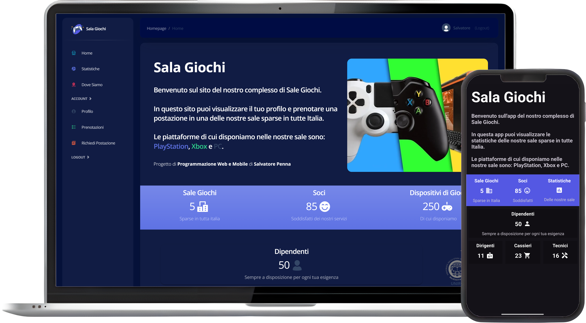

# SalaGiochi

Applicazione gestionale multi‑piattaforma che integra frontend web, backend relazionale e un'app Android.  
Il progetto è stato sviluppato come parte dell'esame *Progettazione Web e Mobile*, simulando la gestione di un complesso di sale giochi.

---

## Funzionalità principali

- **Applicazione web interattiva**: frontend dinamico con Bootstrap e backend in Struts e Spring
- **Persistenza dati**: integrazione con MySQL/OracleDB tramite Hibernate
- **Applicazione mobile dedicata**: app Android per interagire con il sistema da smartphone

---

## Versioni disponibili

Il progetto è sviluppato in più varianti, ognuna basata su uno stack differente:

- [**Struts**](https://github.com/sasopenna/SalaGiochi/tree/main/struts-version) – implementazione basata su Struts 2 e JSP  
- [**Spring**](https://github.com/sasopenna/SalaGiochi/tree/main/spring-version) – implementazione moderna basata su Spring Boot e Thymeleaf  
- [**Android**](https://github.com/sasopenna/SalaGiochi/tree/main/android-version) – app mobile sviluppata in Java che interagisce con il backend

---

## Interfaccia Web e Android

---

## Crediti

Progetto sviluppato da **Salvatore Penna** come parte dell'esame *Progettazione Web e Mobile*.
